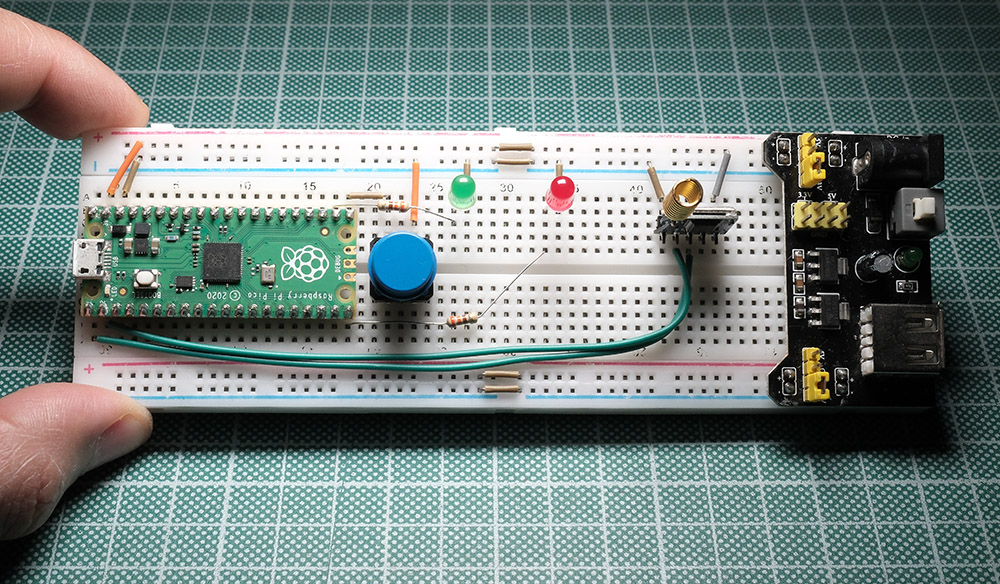

# Reyax RYLR998

In this example you must assemble two identical circuits for understanding how to use a [Reyax RYLR998 LoRa module](https://reyax.com/products/RYLR998).  
  
The important thing is that you cannot power the LoRa module from the 3.3V coming out from the Raspberry Pi Pico since it don't gives  enough current, so an external power source is required.  
    
  

You'll need, in total, 4 leds (with 4 220-330Ohm resistors), 2 tactile pushbuttons, 2 3.3V sources (any) and, of course, 2 Reyax RYLR998 modules and 2 Raspberry Pi Pico (it's good also the W model).  
  
### Connections
- Reyax RYLR998 RX -> GP0
- Reyax RYLR998 TX -> GP1
- Reyax RYLR998 VDD -> external 3.3V source 
- Reyax RYLR998 GND -> common GND
- Pushbutton -> GP16 and GND 
- Green Led anode (+) -> GP17
- Green Led cathode (-) -> GND 
- Red Led anode (+) -> GP15
- Red Led cathode (-) -> GND 
- Raspberry Pi Pico VSYS -> external 3.3V source
- Raspberry Pi Pico GND -> common GND 

### How example works 
Once circuit is powered, program will start and this condition is showed by the green led that will flash continuously since is timer-interrupt driven (notice: you must save program as main.py if you want it to start at power-up).  
  
Everytime you'll push the button, a message with text "ON" will be send through LoRa. The other circuit will receive the message and will toggle the Red led.

### Warnings!!!

There are some settings you need to perform first than upload the code or you can implement them by yourself via code. Module works through AT commands sent via UART interface. Every AT command must end with a carriage return + new line (``\r\n``) otherwise the command will be not recognized. Default baudrate of module is 115200bps. I use a simple UART to USB adapter through a simple terminal emulation software (Termite, Putty, Coolterm etc).
  
#### Frequency
The Reyax RYLR998 module it's capable to work at frequencies between 868 and 915MHz but not all frequency ranges are allowed in your country.  
  
You can read [this page](https://www.thethingsnetwork.org/docs/lorawan/frequencies-by-country/) for knowing which frequencies are allowed in your country. For example, in Italy, are allowed frequencies between ``863`` and ``870``MHz. Since module starts from 868, and this frequency is in the allowed range, I can set (and save) the module frequency using the right AT command and giving the frequency in Hz keeping in mind I'll set the _center_ frequency:  

``AT+BAND=868100000,M`` 

the 'M' at the end of the command is used for store this value in internal eeprom so the next time module will be powered up, it will work at this frequency. If you omit the 'M' flag in the command, everytime you'll start the module it will work at the default frequency (915MHz).  

#### Power Output
The Reyax RYLR998 module has an RF power output up to 22dbm and this is the default value that allows the maximum transmission distance. Anyway, for comply the CE certification, the maximum value must be maximum 14dbm as stated in the manual. You can set the RF output power using the AT command:

``AT+CRFOP=14``

